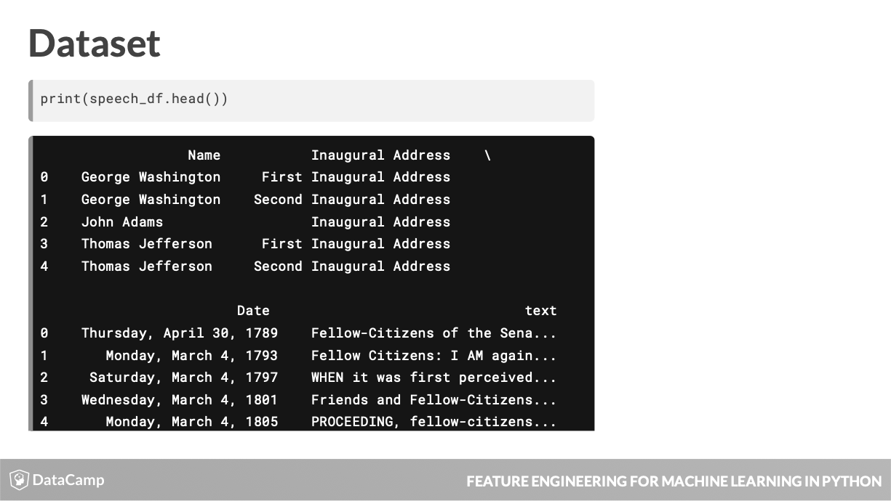
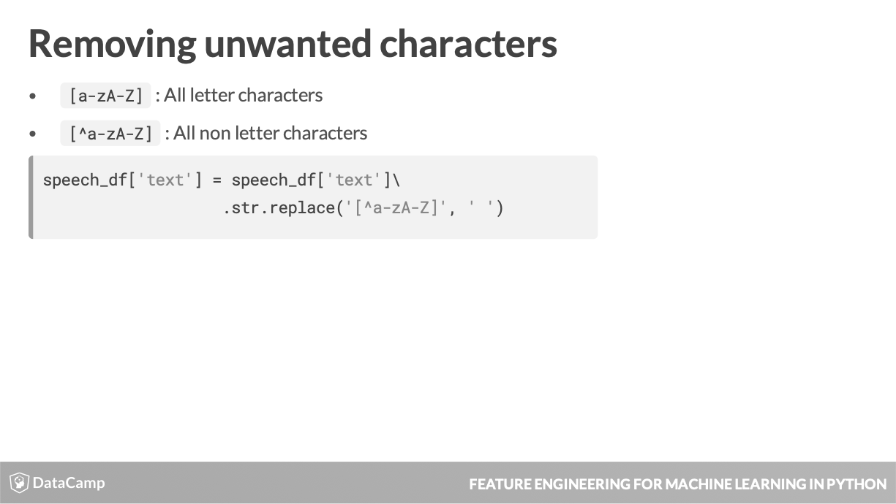
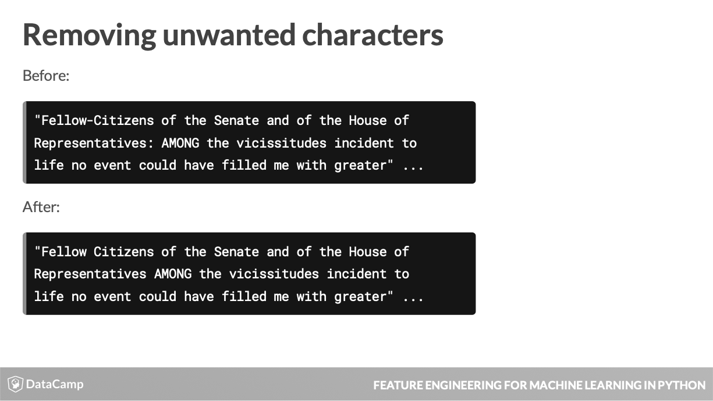
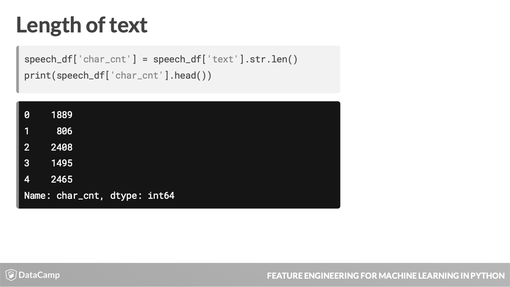
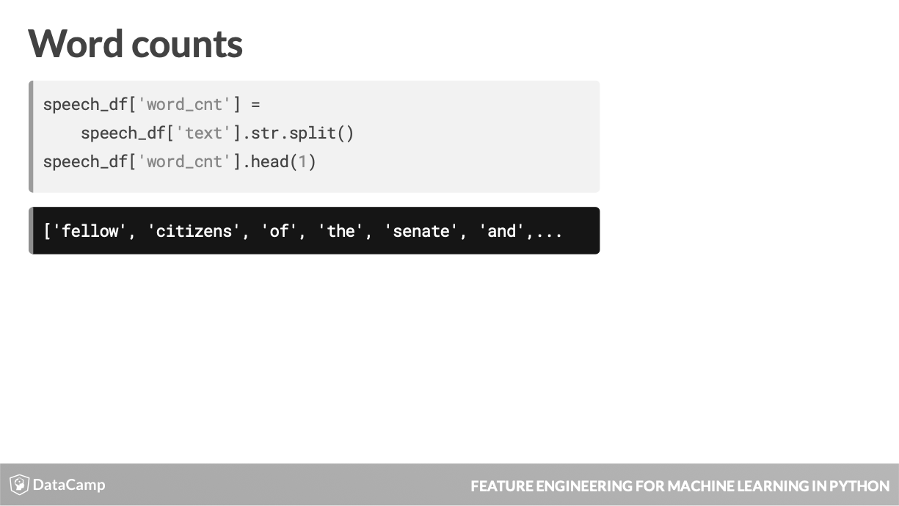

# Feature Engineering: Chapter 2 - Dealing with Messy Data #
Notes from the fourth chapter of the DataCamp Feature Engineering course accessible [here](https://learn.datacamp.com/courses/feature-engineering-for-machine-learning-in-python).

- This lesson will explore the concept of messy and missing values, how to find them, and once identified how to deal with them.

|  |
| :-: |
| Real-world data often has noise or omissions that can stem from many sources, like those above. |

- Data collection issue:
  - Paper surveys not being filled out fully
- Collection & Management Errors:
  - Making a mistake in transcribing the data.
- Omission issue:
  - Respondents skipping the age box in an online form.
- Transformation issue:
  - Average of a field with missing data.
  

- Many machine learning models can't work with missing values.
  - A linear regression models needs a value for every row and column used in the data set.
- Missing data can clue you in to a data pipeline issue.
  - If data is consistently missing in a certain column, you ought to investigate as to why this is the case.
- Missing data can also provide information in and of itself:
  - a missing value for children means no children.
  
|  |
| :-: |
| Use **info()** method for a preliminary look at data completeness. |

- Here you can see that StackOverflorJobsRecommend, Gender and RawSalary are highly underpopulated. Thi prompts investigating where these missing values occur.
- Thislist is useful but becomes limited with larger datasets that have values missing scattered all over their features.

- To find where these missing values exist, use the **isnull()** method.
  - All cells where missing values exist are shown as True.
  
|  |
| :-: |
| Count the number of missing values in a column by chaining **isnull()** with **sum()** methods. |
|  |
| Using **notnull()** will show you non-missing values (False). |

- Usage of **isnull()** & **notnull()** is allowed on the DataDrame as a whole and on each individual column.

