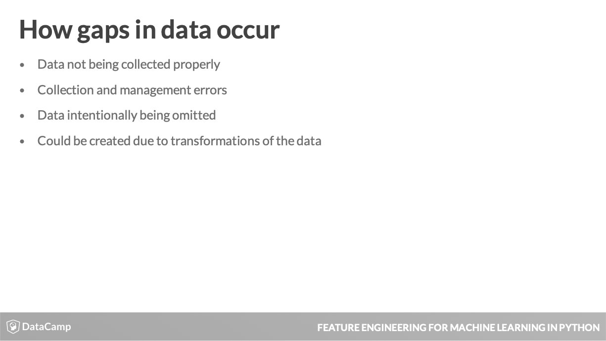
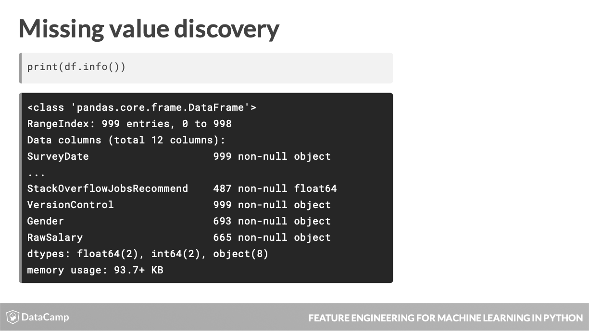
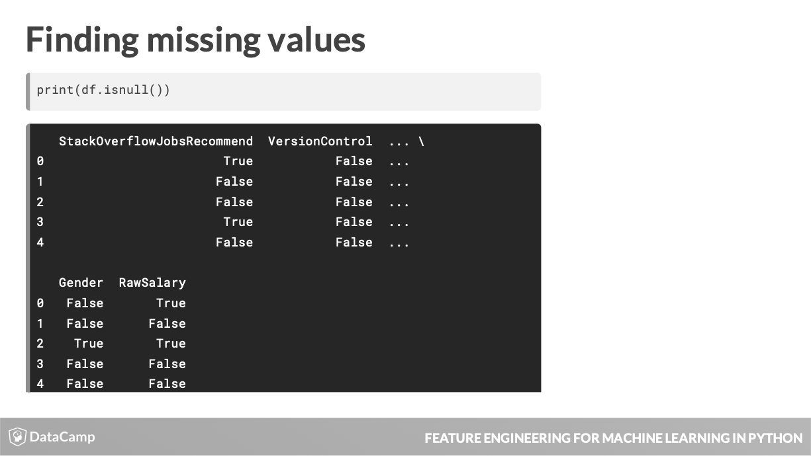
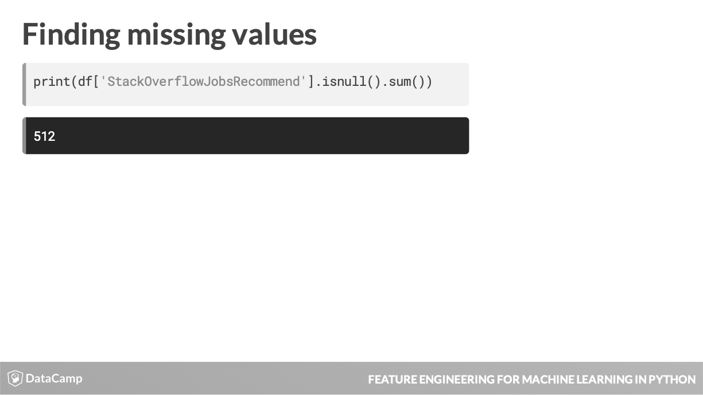
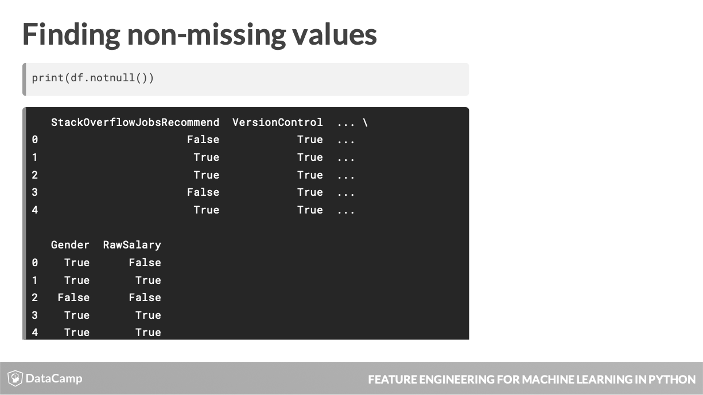

# Feature Engineering: Chapter 2 - Dealing with Messy Data #
Notes from the fourth chapter of the DataCamp Feature Engineering course accessible [here](https://learn.datacamp.com/courses/feature-engineering-for-machine-learning-in-python).

- This lesson will explore the concept of messy and missing values, how to find them, and once identified how to deal with them.

|  |
| :-: |
| Real-world data often has noise or omissions that can stem from many sources, like those above. |

- Data collection issue:
  - Paper surveys not being filled out fully
- Collection & Management Errors:
  - Making a mistake in transcribing the data.
- Omission issue:
  - Respondents skipping the age box in an online form.
- Transformation issue:
  - Average of a field with missing data.
  

- Many machine learning models can't work with missing values.
  - A linear regression models needs a value for every row and column used in the data set.
- Missing data can clue you in to a data pipeline issue.
  - If data is consistently missing in a certain column, you ought to investigate as to why this is the case.
- Missing data can also provide information in and of itself:
  - a missing value for children means no children.
  
|  |
| :-: |
| Use **info()** method for a preliminary look at data completeness. |

- Here you can see that StackOverflorJobsRecommend, Gender and RawSalary are highly underpopulated. Thi prompts investigating where these missing values occur.
- Thislist is useful but becomes limited with larger datasets that have values missing scattered all over their features.

- To find where these missing values exist, use the **isnull()** method.
  - All cells where missing values exist are shown as True.
  
|  |
| :-: |
| Count the number of missing values in a column by chaining **isnull()** with **sum()** methods. |
|  |
| Using **notnull()** will show you non-missing values (False). |

- Usage of **isnull()** & **notnull()** is allowed on the DataDrame as a whole and on each individual column.

- How sparse is my data?
  - Most data sets contain missing values, often represented as NaN (Not a Number). If you are working with Pandas you can easily check how many missing values exist in each column.    Let's find out how many of the developers taking the survey chose to enter their age (found in the Age column of so\_survey_df) and their gender (Gender column of so\_survey_df).
  
	# Subset the DataFrame
	sub_df = so_survey_df[['Age','Gender']]
        
	# Print the number of non-missing values
	print(sub_df.notnull().sum())

- Based on the results, the **Gender** column has 693 non-missing entries.

- Finding the missing values
  - While having a summary of how much of your data is missing can be useful, often you will need to find the exact locations of these missing values. Using the same subset of the StackOverflow data from the last exercise (sub_df), you will show how a value can be flagged as missing.
  
	# Print the top 10 entries of the DataFrame
	print(sub_df.head(10))
	
	# Print the locations of the missing values
	print(sub_df.head(10).isnull())
	
	# Print the locations of the non-missing values
	print(sub_df.head(10).notnull())

  - Finding where the missing values exist can often be important.