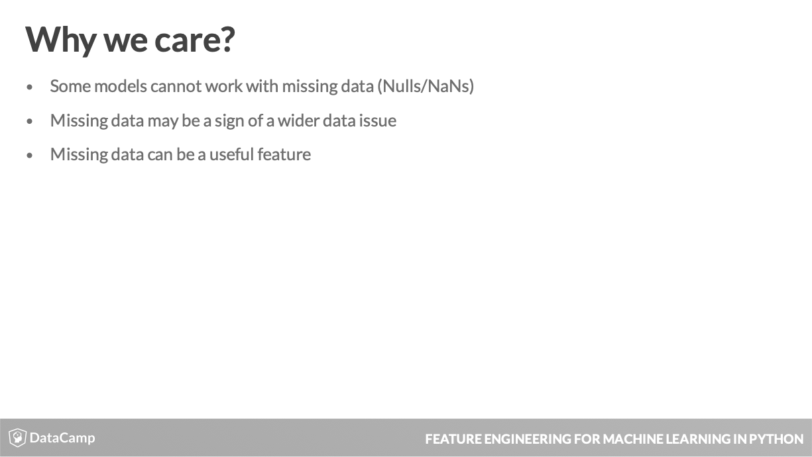
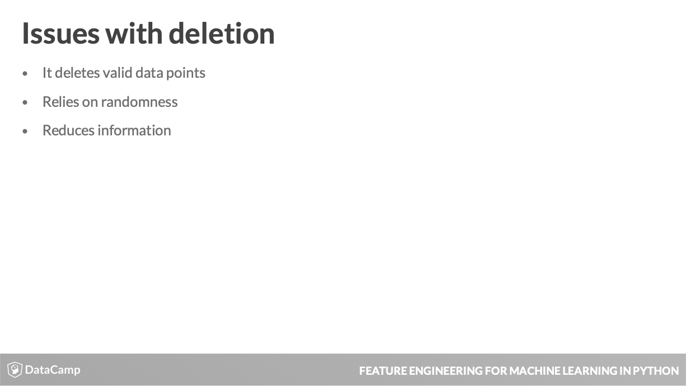

# Feature Engineering: Chapter 2 - Dealing with Messy Data #
Notes from the second chapter of the DataCamp Feature Engineering course accessible [here](https://learn.datacamp.com/courses/feature-engineering-for-machine-learning-in-python).

- This lesson will explore the concept of messy and missing values, how to find them, and once identified how to deal with them.

|  |
| :-: |
| Real-world data often has noise or omissions that can stem from many sources, like those above. |

- Data collection issue:
  - Paper surveys not being filled out fully
- Collection & Management Errors:
  - Making a mistake in transcribing the data.
- Omission issue:
  - Respondents skipping the age box in an online form.
- Transformation issue:
  - Average of a field with missing data.
  

- Many machine learning models can't work with missing values.
  - A linear regression models needs a value for every row and column used in the data set.
- Missing data can clue you in to a data pipeline issue.
  - If data is consistently missing in a certain column, you ought to investigate as to why this is the case.
- Missing data can also provide information in and of itself:
  - a missing value for children means no children.
  
|  |
| :-: |
| Use **info()** method for a preliminary look at data completeness. |

- Here you can see that StackOverflorJobsRecommend, Gender and RawSalary are highly underpopulated. Thi prompts investigating where these missing values occur.
- Thislist is useful but becomes limited with larger datasets that have values missing scattered all over their features.

- To find where these missing values exist, use the **isnull()** method.
  - All cells where missing values exist are shown as True.
  
|  |
| :-: |
| Count the number of missing values in a column by chaining **isnull()** with **sum()** methods. |
|  |
| Using **notnull()** will show you non-missing values (False). |

- Usage of **isnull()** & **notnull()** is allowed on the DataDrame as a whole and on each individual column.

- How sparse is my data?
  - Most data sets contain missing values, often represented as NaN (Not a Number). If you are working with Pandas you can easily check how many missing values exist in each column.    Let's find out how many of the developers taking the survey chose to enter their age (found in the Age column of so\_survey_df) and their gender (Gender column of so\_survey_df).
  
	    # Subset the DataFrame
	    sub_df = so_survey_df[['Age','Gender']]
        
	    # Print the number of non-missing values
	    print(sub_df.notnull().sum())

- Based on the results, the **Gender** column has 693 non-missing entries.

- Finding the missing values
  - While having a summary of how much of your data is missing can be useful, often you will need to find the exact locations of these missing values. Using the same subset of the StackOverflow data from the last exercise (sub_df), you will show how a value can be flagged as missing.
  
	    # Print the top 10 entries of the DataFrame
	    print(sub_df.head(10))
	
	    # Print the locations of the missing values
	    print(sub_df.head(10).isnull())
	
	    # Print the locations of the non-missing values
	    print(sub_df.head(10).notnull())

  - Finding where the missing values exist can often be important.
  

- Now that we can find the missing data, let's learn how to deal with them.

|  |
| :-: |
| Under **listwise deletion** the first and third rows will be dropped because of missing values in the _ConvertedSalary_ column. |

- If you're confident the missing values are occuring randomly (not intentionally being omitted) the most effective & statistically sound approach to dealing with them is called **complete case analysis** or **listwise deletion**.
  - In this method, a record is fully excluded from your model if any of its values are missing.
  

 - Using pandas to implement listwise deletion, set the _how_ argument to 'any', to delete all rows with at least one missing value.
 
|  |
| :-: |
| To drop rows with missing values in a specific column, use the _subset_ argument. |

- Pass a list of columns to the _subset_ argument to specify which columns to consider when deleting rows.

- While the prefereable approach to missing data is listwise deletion, there're drawbacks:
  - Any valid data points that share a row with th emissing values ger deleted.
  - If values don't occur at random, it can negatively affect the model.
  - Removing a feature instead of a row reduces the degrees of freedom of your model.
  

- The most common way to deal with missing values is to use the **fillna()** method.
  - You provide the value that you want to replace the missing values with.
  - With categorical columns, it's common to replace missing values with strings like 'Other', 'Not Given', etc.
  - To modify the values in-place, in the original DataFrame, set the _inplace_ argument to True.
  

- When you believe that the absence or presence of data is more important than the values themselves, you can create a column that records the absence of data and then drop the original column.
  - Call the **notnull()** method on a specific column, recording with True or False the presence of data.
  - To drop columns from a DataFrame, you can use the **drop()** method.
    - Specify a list of column names you want to drop via the _columns_ argument.

- Listwise deletion
  - The simplest way to deal with missing values in your dataset when they are occurring entirely at random is to remove those rows, also called 'listwise deletion'.   Depending on the use case, you will sometimes want to remove all missing values in your data while other times you may want to only remove a particular column if too many values are missing in that column.
  
		# Print the number of rows and columns
		print(so_survey_df.shape)
		
		# Create a new DataFrame dropping all incomplete rows
		no_missing_values_rows = so_survey_df.dropna()
		
		# Print the shape of the new DataFrame
		print(no_missing_values_rows.shape)
		
		# Create a new DataFrame dropping all columns with incomplete rows
		no_missing_values_cols = so_survey_df.dropna(how = 'any', axis=1)
		
		# Print the shape of the new DataFrame
		print(no_missing_values_cols.shape)
		
		# Drop all rows where Gender is missing
		no_gender = so_survey_df.dropna(subset = ['Gender'])
		
		# Print the shape of the new DataFrame
		print(no_gender.shape)

  -  As you can see dropping all rows that contain any missing values may greatly reduce the size of your dataset. So you need to think carefully and consider several trade-offs when deleting missing values.

- Replacing missing values with constants
  - While removing missing data entirely maybe a correct approach in many situations, this may result in a lot of information being omitted from your models.   You may find categorical columns where the missing value is a valid piece of information in itself, such as someone refusing to answer a question in a survey. In these cases, you can fill all missing values with a new category entirely, for example 'No response given'.
  
		# Print the count of occurrences
		print(so_survey_df['Gender'].value_counts())
		
		# Replace missing values
		so_survey_df['Gender'].fillna('Not Given', inplace = True)
		
		# Print the count of each value
		print(so_survey_df['Gender'].value_counts())

  - By filling in these missing values you can use the columns in your analyses.

- Listwise Deletion will often not be feasible in real world use cases.

- A common issue with removing all the rows with missing values is in building a predictive model.
  - When training your model, removing rows would quickly result in errors if your test data set had missing values, where you do not have the option of just not predicting these rows.

- The alternative:
  - Replacing missing values.

- What's a suitable value?
  - Using a commonly occuring value along the lines of a mean or median.
    - Using these methods can lead to biased estimates of the variances and covariances of the features.
	- The standard error and test statistics can be incorrectly estimated.
	- If these emtrics are needed, they should be calculated before the missing values have been filled.

|  |
| :-: |
| Calculate directly from a pandas Series by calling the mean/median method on the series. The missing values are excluded by default when calculating these statistics. |
|  |
| Fill the missing values, using **fillna()** with the **mean()** of that column. |

- Using **mean()** may result in too many decimal places.
  - Using the **astype()** method will remove all the decimal places.
  
|  |
| :-: |
| You're also able to round the mean before filling the missing values with it. |

- Filling continuous missing values
  - In the last lesson, you dealt with different methods of removing data missing values and filling in missing values with a fixed string. These approaches are valid in many cases, particularly when dealing with categorical columns but have limited use when working with continuous values. In these cases, it may be most valid to fill the missing values in the column with a value calculated from the entries present in the column.
  
		# Print the first five rows of StackOverflowJobsRecommend column
		print(so_survey_df.StackOverflowJobsRecommend.head())
		
		# Fill missing values with the mean
		so_survey_df['StackOverflowJobsRecommend'].fillna(so_survey_df['StackOverflowJobsRecommend'].mean(), inplace = True)
		
		# Print the first five rows of StackOverflowJobsRecommend column
		print(so_survey_df['StackOverflowJobsRecommend'].head())
		
		# Fill missing values with the mean
		so_survey_df['StackOverflowJobsRecommend'].fillna(so_survey_df['StackOverflowJobsRecommend'].mean(), inplace=True)
		
		# Round the StackOverflowJobsRecommend values
		so_survey_df['StackOverflowJobsRecommend'] = round(so_survey_df['StackOverflowJobsRecommend'])
		
		# Print the top 5 rows
		print(so_survey_df['StackOverflowJobsRecommend'].head())
  - Remember you should only round your values if you are certain it is applicable.

|  |
| :-: |
| Never calculate values based on your test set. Values calculated on the train test should be applied to both DataFrames. |

