# Feature Engineering: Chapter 4 - Intro to Text Encoding #
Notes from the fourth chapter of the DataCamp Feature Engineering course accessible [here](https://learn.datacamp.com/courses/feature-engineering-for-machine-learning-in-python).

|  |
| :-: |
| This is an example of free text associated with a speech given by George Washington. |

- Data that is not in a predefined form is called unstructured data, and free text data is a good example of this.
- Before you can leverage text data ina  machine learning model you must first convert it into a series of columns of numbers or vectors.

| 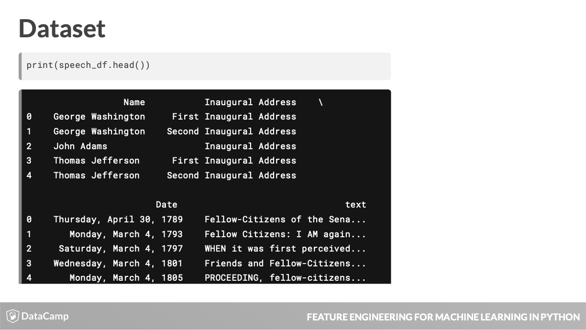 |
| :-: |
| The 'text' column contains the body of the speech text. |

- Before any text analytics can be performed, the text data must be in a format that can be used.

|  |
| :-: |
| Here, using regular expressions will allow you to select non-letter characters. |

- Most bodies of text will have non letter characters such as punctuation, that will need ot be removed before analysis.
- Selecting all the letter characters and placing a caret infront negates this, making the selected characters non-letter and replace it with a white space.

|  |
| :-: |
| The text of the first speech before and after processing via .replace() & regular expressions.|
| 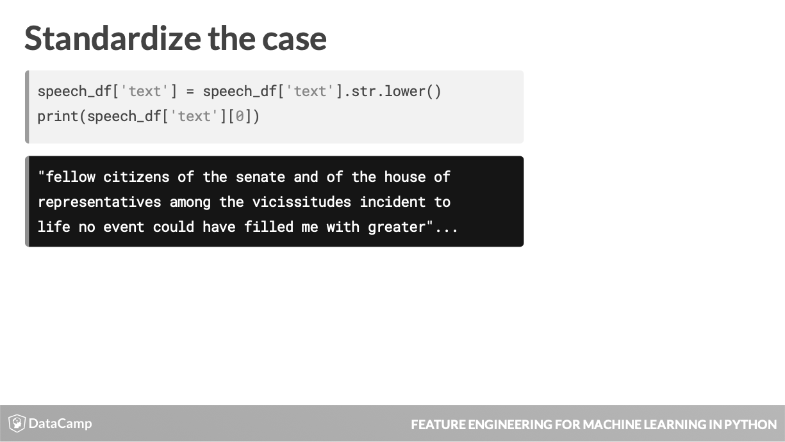 |
| Next standardize the remaining characters by making them all lowercase. |

- Standardizing the text, by making them all lowercase ensure that the same word with/out capitalization won't be counted as separate words.

|  |
| :-: |
| The len() method calculates the number of characters in each speech. |

- You can even create features based on the content of different texts, but often there is value in the fundamental characteristics of a passage, such as its length.

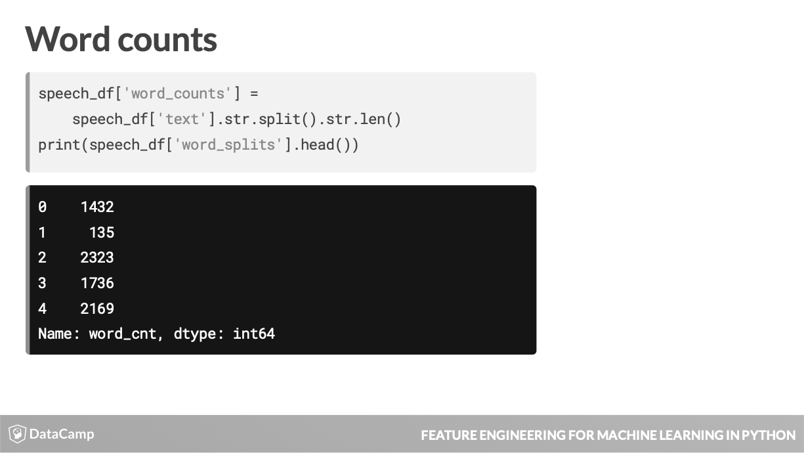

- You may want to learn how many words are contained in the text, by splitting the speech based on the white spaces and then count how many words after the split.
- First, use the split() method then chain the len() method to count the number of words in each speech.

| 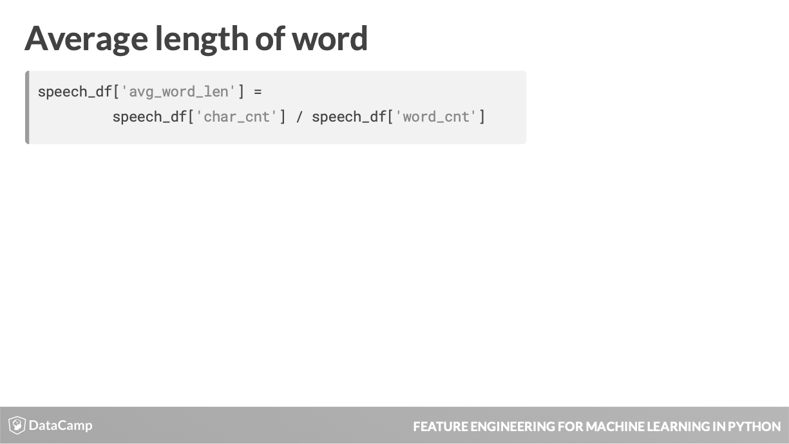 |
| :-: |
| Simply dividing the character count by the number of words gives you the average word length. |

- You can also get the average word length.

- Unstructured text data cannot be directly used in most analyses. Multiple steps need to be taken to go from a long free form string to a set of numeric columns in the right format that can be ingested by a machine learning model. The first step of this process is to standardize the data and eliminate any characters that could cause problems later on in your analytic pipeline.    In this chapter you will be working with a new dataset containing the inaugural speeches of the presidents of the United States loaded as speech_df, with the speeches stored in the text column.

        # Print the first 5 rows of the text column
		print(speech_df.text.head())
		
		# Replace all non letter characters with a whitespace
		speech_df['text_clean'] = speech_df['text'].str.replace('[^a-zA-Z]', ' ')
		
		# Change to lower case
		speech_df['text_clean'] = speech_df['text_clean'].str.lower()
		
		# Print the first 5 rows of the text_clean column
		print(speech_df['text_clean'].head())

  - Now your text strings have been standardized and cleaned up. You can now use this new column (text_clean) to extract information about the speeches.

		# Find the length of each text
		speech_df['char_cnt'] = speech_df['text_clean'].str.len()
		
		# Count the number of words in each text
		speech_df['word_cnt'] = speech_df['text_clean'].str.split().str.len()
		
		# Find the average length of word
		speech_df['avg_word_length'] = speech_df.char_cnt / speech_df.word_cnt
		
		# Print the first 5 rows of these columns
		print(speech_df[['text_clean', 'char_cnt', 'word_cnt', 'avg_word_length']])

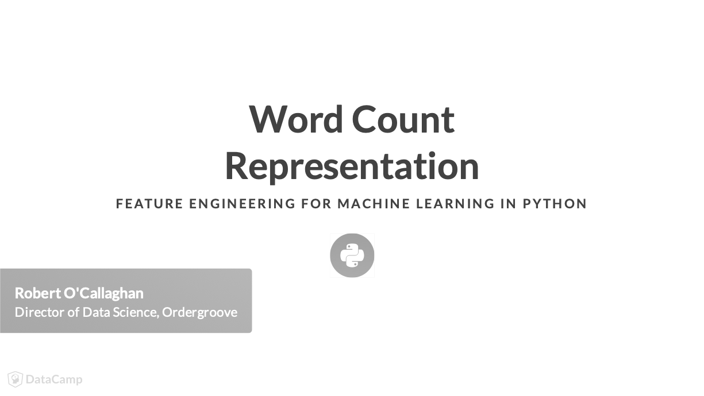

- Once high level info has been recorded you can begin creating features based on the actual content of each text.

| 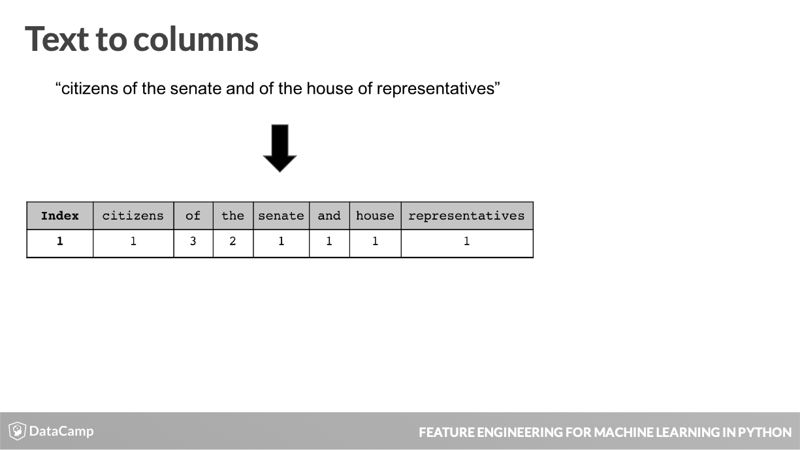 |
| :-: |
| The most common approach to creating features is to create a column for each word. |
| 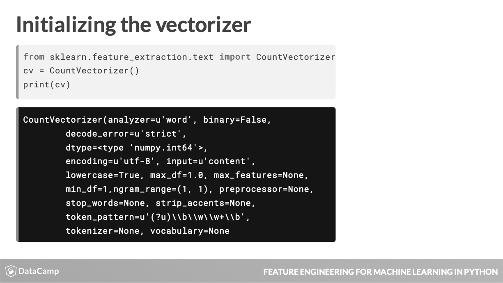 |
| scikit-learn provides the functionality to count the number of words. |
| 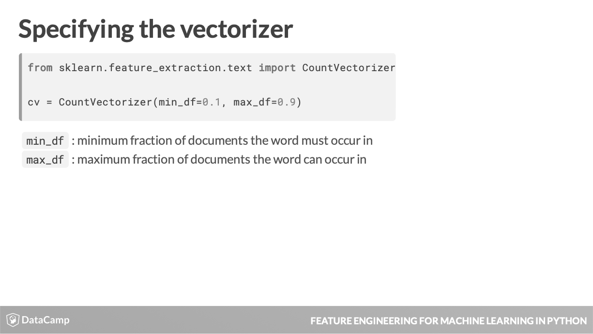 |
| Specify arguments in order to limit the number of columns created for text. |

- Creating a column for every word will result in far too many values for analyses.
- Specifying **min_df()** dictates the minimum number of texts that a word must be contained in. If a float is given, the word must appear in at least that percent of documents.
  - This threshold eliminates words that occur so rarely that they would not be useful when generalizing to new texts.
- **max_df()** limits words to only ones that occur below a certain percentage of data.
  - This can be useful to remove words that occur too frequently to be of any value.

| 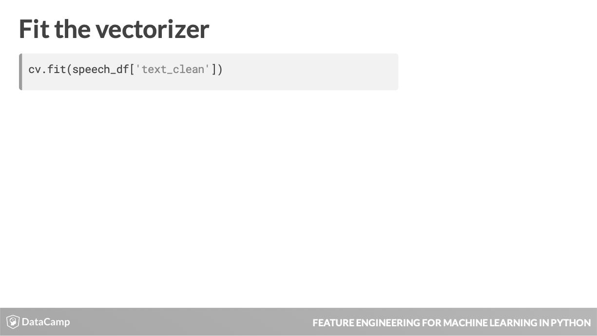 |
| :-: |
| You call the **fit()** method on the relevant column. |

- Once the vectorizer's been instatiated you can fit it to the data you want to create your features around.

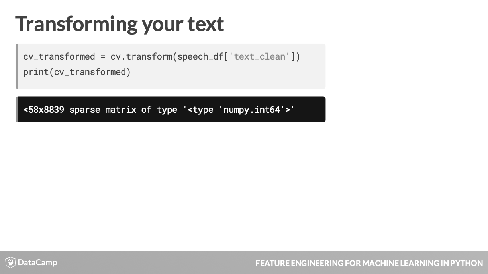

- Once the vectorizer's been fit, you can call the **transform()** method on the column you want to transform. 
- The output is a sparse array with a row for every text and a column for every word that's been counted.

| 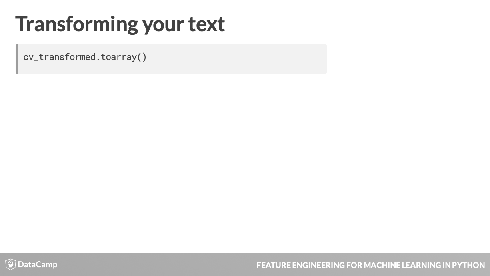 |
| :-: |
| To transform to a non-sparse array use **toarray()** method. |
| 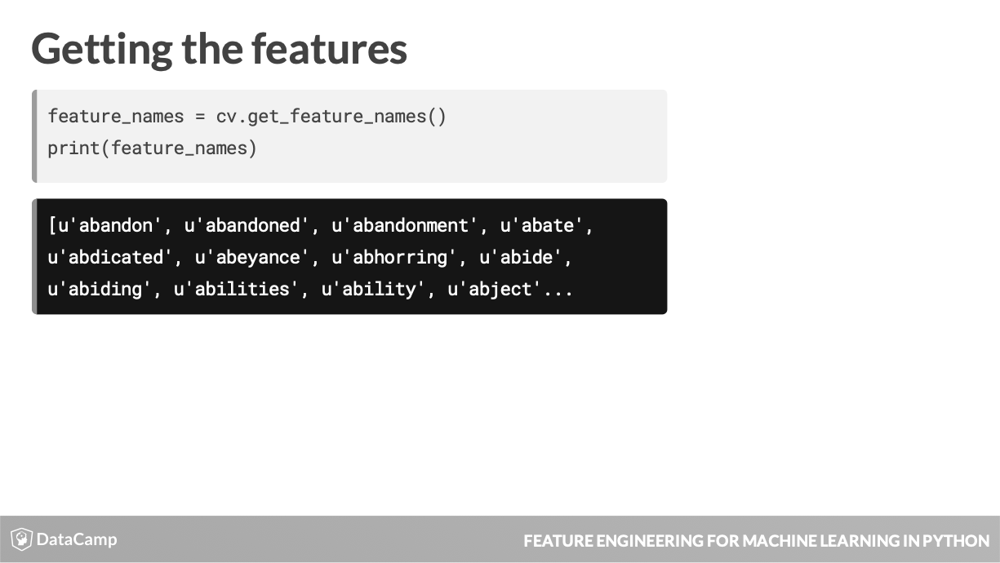 |
| The output is an array without the concept of column names. |

- To get the names of the features that have been generated, use the **get_feature_names()** on the vectorizer.
  - This returns a list of the features generated, in the same order that the columns of the converted array are in.
  
| 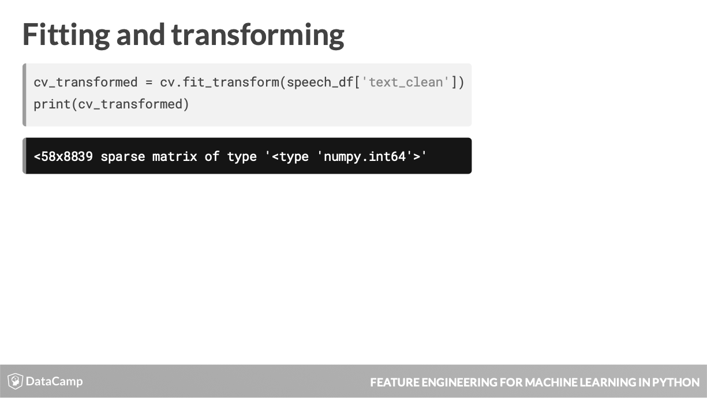 |
| :-: |
| You can perform bot a fit and transform in one method called **fit_transform()**. |

- While fitting and transforming separately can be useful, particularly when you need to transform a different data set than the one that you used to fit the vectorizer to, you can accomplish both steps at once using the **fit_transform()** method.

| 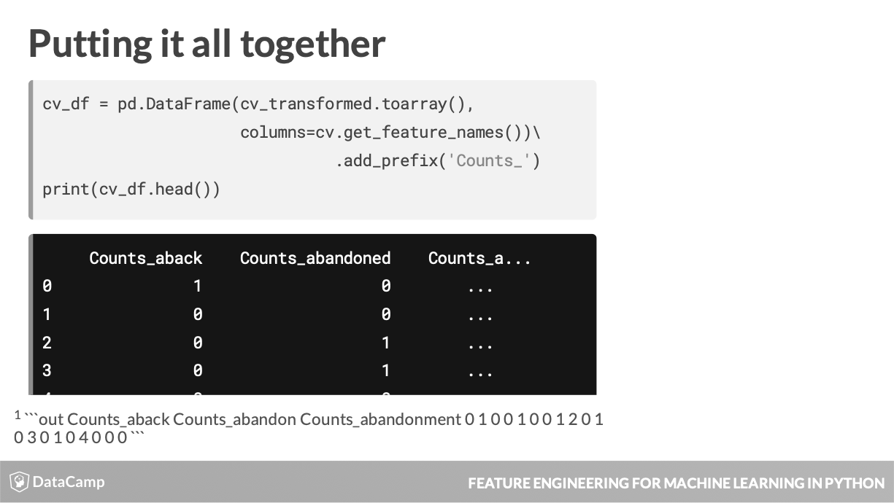 |
| :-: |
| **add_prefix()** allows for distiguishing columns in the DataFrame. |

- Now with the array containing the count values of each words of interest, and a way to get the feature names, you can combine them into a DataFrame like above.

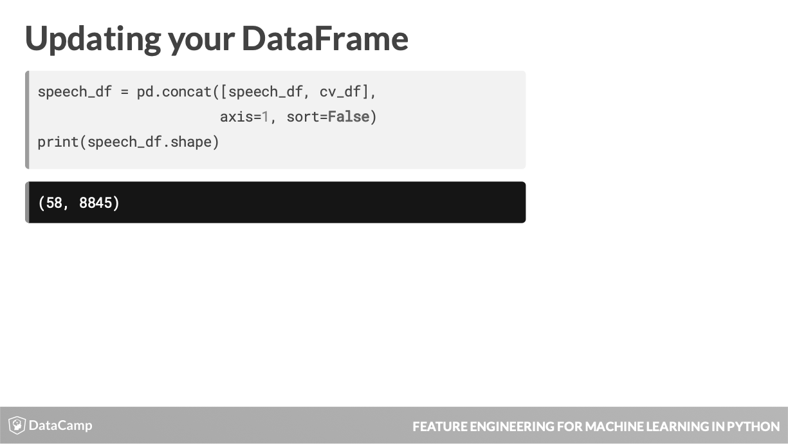

- You can combine this DataFrame to your original DataFrame so they can be used to generate future analytical models using pandas **concat()** method.

- Once high level information has been recorded you can begin creating features based on the actual content of each text. One way to do this is to approach it in a similar way to how you worked with categorical variables in the earlier lessons.

  - For each unique word in the dataset a column is created.
  - For each entry, the number of times this word occurs is counted and the count value is entered into the respective column.

- These "count" columns can then be used to train machine learning models.

		# Import CountVectorizer
		from sklearn.feature_extraction.text import CountVectorizer
		
		# Instantiate CountVectorizer
		cv = CountVectorizer()
		
		# Fit the vectorizer
		cv.fit(speech_df['text_clean'])
		
		# Print feature names
		print(cv.get_feature_names())

- Once the vectorizer has been fit to the data, it can be used to transform the text to an array representing the word counts. This array will have a row per block of text and a column for each of the features generated by the vectorizer that you observed in the last exercise.

		# Apply the vectorizer
		cv_transformed = cv.transform(speech_df['text_clean'])
		
		# Print the full array
		cv_array = cv_transformed.toarray()
		print(cv_array)
		
		# Print the shape of cv_array
		print(cv_array.shape)

- The speeches have 9043 unique words, which is a lot! In the next exercise, you will see how to create a limited set of features.

- As you have seen, using the CountVectorizer with its default settings creates a feature for every single word in your corpus. This can create far too many features, often including ones that will provide very little analytical value.   For this purpose CountVectorizer has parameters that you can set to reduce the number of features:
  - min_df : Use only words that occur in more than this percentage of documents. This can be used to remove outlier words that will not generalize across texts.
  - max_df : Use only words that occur in less than this percentage of documents. This is useful to eliminate very common words that occur in every corpus without adding value such as "and" or "the".

		# Import CountVectorizer
		from sklearn.feature_extraction.text import CountVectorizer
		
		# Specify arguements to limit the number of features generated
		cv = CountVectorizer(min_df = 0.2, max_df = 0.8)
		
		# Fit, transform, and convert into array
		cv_transformed = cv.fit_transform(speech_df['text_clean'])
		cv_array = cv_transformed.toarray()
		
		# Print the array shape
		print(cv_array.shape)

- Did you notice that the number of features (unique words) greatly reduced from 9043 to 818?

- Now that you have generated these count based features in an array you will need to reformat them so that they can be combined with the rest of the dataset. This can be achieved by converting the array into a pandas DataFrame, with the feature names you found earlier as the column names, and then concatenate it with the original DataFrame.    The numpy array (cv_array) and the vectorizer (cv) you fit in the last exercise are available in your workspace.

		# Create a DataFrame with these features
		cv_df = pd.DataFrame(cv_array, 
		                     columns=cv.get_feature_names()).add_prefix('Counts_')
							 
		# Add the new columns to the original DataFrame
		speech_df_new = pd.concat([speech_df, cv_df], axis=1, sort=False)
		print(speech_df_new.head())

- With the new features combined with the orginial DataFrame they can be now used for ML models or analysis.

- Counts of occurences of words can be a good first step towards encoding your text to build models, it has some limitations.
  - The main issue is counts will be much higher for very common words even when they occur across all texts, providing little value as a distinguishing feature.
  
| 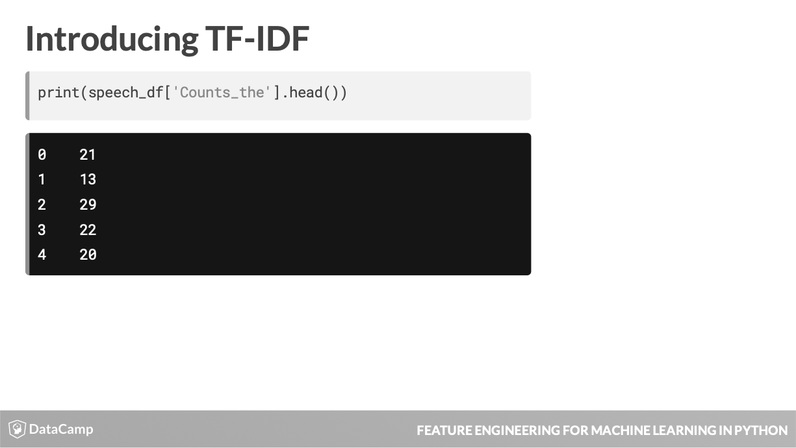 |
| :-: |
| The word 'the' shows up, quite often, in several columns. |

- To limit these words from overpowering your model normalization can be used.
  - One of the most effective approaches is called **Term Frequency Inverse Document Frequency** or _TF-IDF_.

| 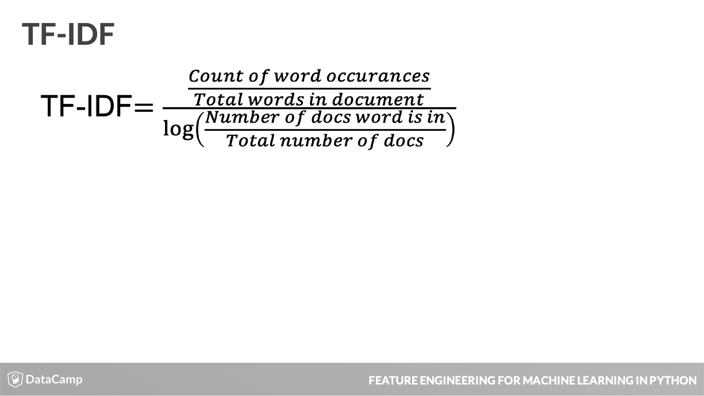 |
| :-: |
| TF-IDF divides the number of times a word occurs in a document by a measure of what proportion of the document a word occurs in all documents. |

- This has the effect of reducing the value of common words, while increasing the weight of words that do not occur in many documents.

| 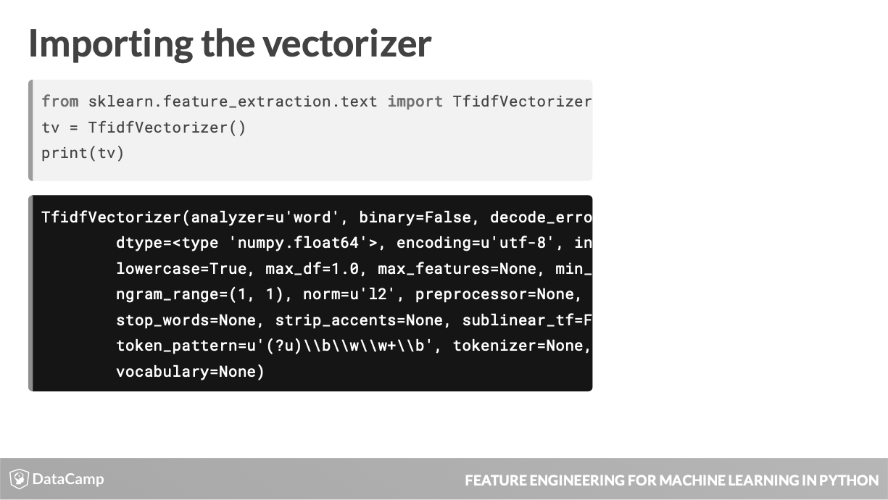 |
| :-: |
| You import it similarly to the Count Vectorizer from before. |
| 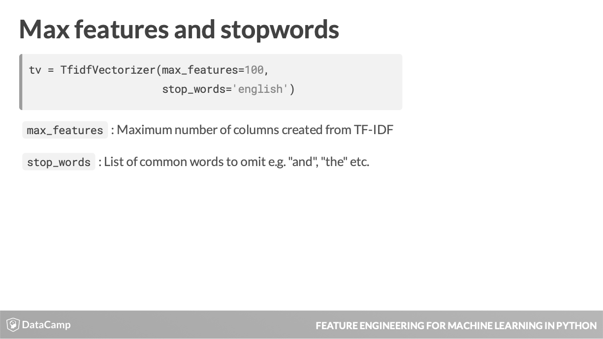 |
| Using **max\_features** argument allows you to use only the most common words.    While **stop\_words** allows you to omit common words like 'and' or 'the'. |

- For stop words, you can use scikit-learn's built in list, load your own, or use lists provided by other python libraries.

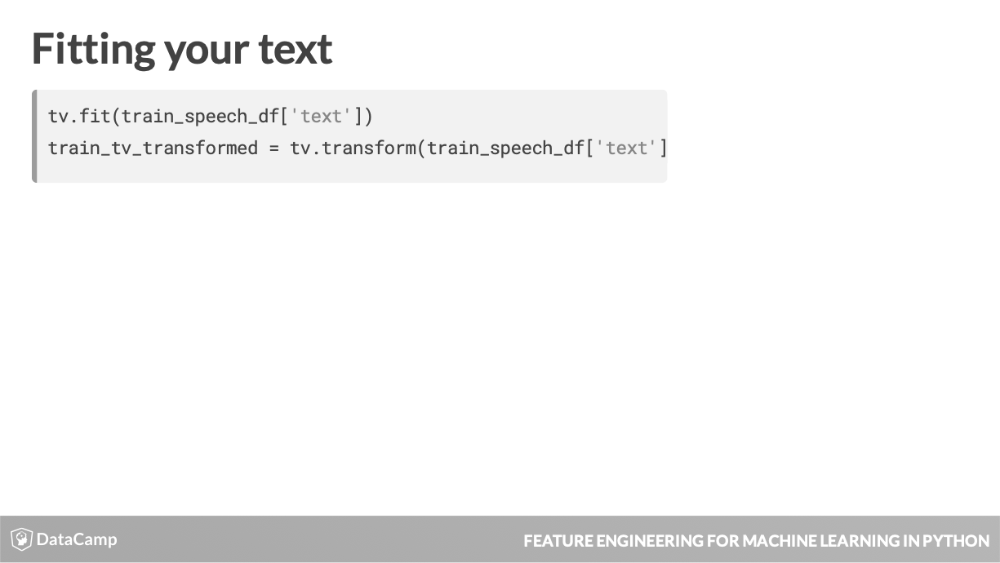

- Once the vectorizer's been specified, you can fit it, and apply it to the text that you want to transform. 
  - Here, we're fitting and transforming the train data, a subset of the original data.
  
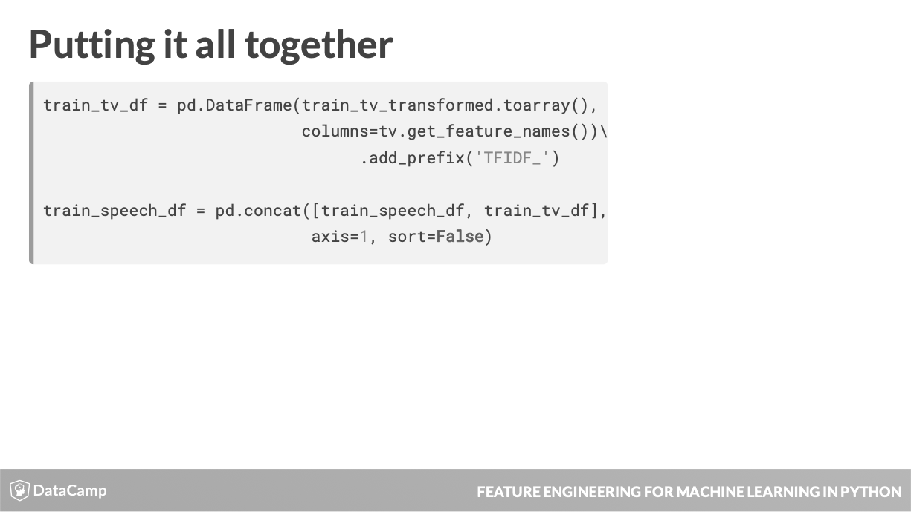

- You combine the TF-IDF values along with the feature names in  DataFrame as shown above.

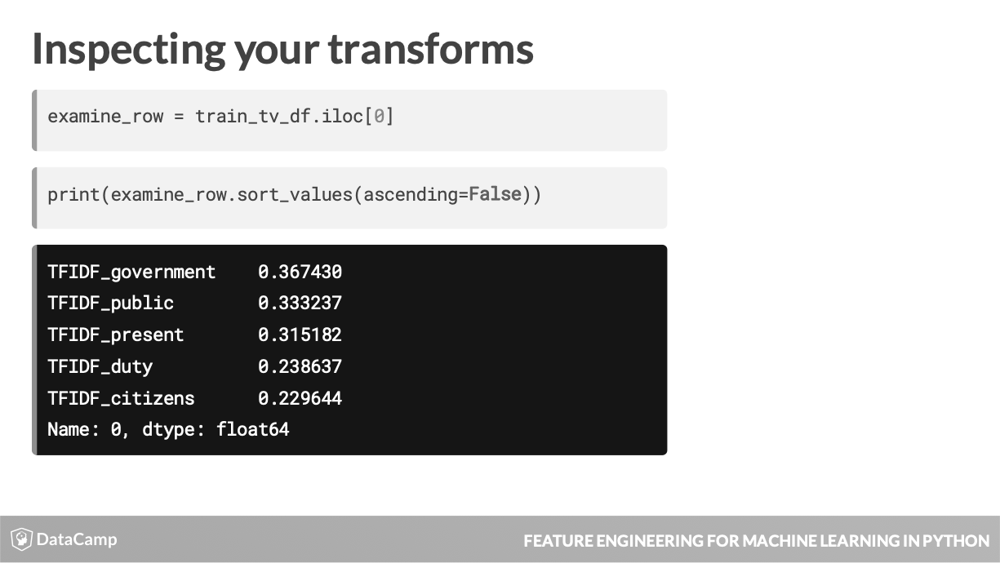

- Here, you check how the different words are being valued, and see which words are receiving the highest scores through the process.
  - This will help you understand if the features being generated makes sense or not.
- One ad hoc method is to isolate a single row of transformed DataFrame (tv\_df in this case) using the iloc accessor, and then sorting the values in the row in descending order as shown here.
  - These top ranked values make sense for a text of a presidential speech.
  
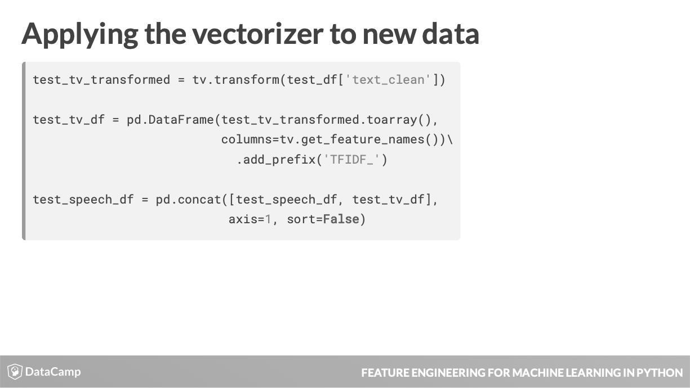

- How do you apply your model to test data?
  - You should preprocess your test data using the transformations made on the train data only to ensure that the same features are created you should use the same vectorizer that you fit on the training data.
  - First transform the test data using the tv vectorizer and then recreate the test data by combining the TF-IDF values, feature names, and other columns.

- While counts of occurrences of words can be useful to build models, words that occur many times may skew the results undesirably. To limit these common words from overpowering your model a form of normalization can be used. In this lesson you will be using Term frequency-inverse document frequency (Tf-idf) as was discussed in the video. Tf-idf has the effect of reducing the value of common words, while increasing the weight of words that do not occur in many documents.

		# Import TfidfVectorizer
		from sklearn.feature_extraction.text import TfidfVectorizer
		
		# Instantiate TfidfVectorizer
		tv = TfidfVectorizer(max_features = 100, stop_words = 'english')
		
		# Fit the vectroizer and transform the data
		tv_transformed = tv.fit_transform(speech_df['text_clean'])
		
		# Create a DataFrame with these features
		tv_df = pd.DataFrame(tv_transformed.toarray(), 
		                     columns=tv.get_feature_names()).add_prefix('TFIDF_')
		print(tv_df.head())

  - Did you notice that counting the word occurences and calculating the Tf-idf weights are very similar? This is one of the reasons scikit-learn is very popular, a consistent API.
  
- After creating Tf-idf features you will often want to understand what are the most highest scored words for each corpus. This can be achieved by isolating the row you want to examine and then sorting the the scores from high to low.

		# Isolate the row to be examined
		sample_row = tv_df.iloc[0,:]
		
		# Print the top 5 words of the sorted output
		print(sample_row.sort_values(ascending=False).head())

  - Do you think these scores make sense for the corresponding words?
  
- When creating vectors from text, any transformations that you perform before training a machine learning model, you also need to apply on the new unseen (test) data. To achieve this follow the same approach from the last chapter: fit the vectorizer only on the training data, and apply it to the test data.   For this exercise the speech_df DataFrame has been split in two:
  - train_speech_df: The training set consisting of the first 45 speeches.
  - test_speech_df: The test set consisting of the remaining speeches.

    	# Instantiate TfidfVectorizer
    	tv = TfidfVectorizer(max_features=100, stop_words='english')
		
    	# Fit the vectroizer and transform the data
	    tv_transformed = tv.fit_transform(train_speech_df.text_clean)
		
	    # Transform test data
	    test_tv_transformed = tv.transform(test_speech_df.text_clean)
		
    	# Create new features for the test set
	    test_tv_df = pd.DataFrame(test_tv_transformed.toarray(), 
	                          columns=tv.get_feature_names()).add_prefix('TFIDF_')
	    print(test_tv_df.head())

  - The vectorizer should only be fit on the train set, never on your test set.
  

- Looking at individual words on their own without any context or word order is called a bag-of words model.
  - The words are treated as if they're being drawn from a bag with no concept or order or grammar.
  - Individual words can lose all their context/meaning when viewed independently.
  
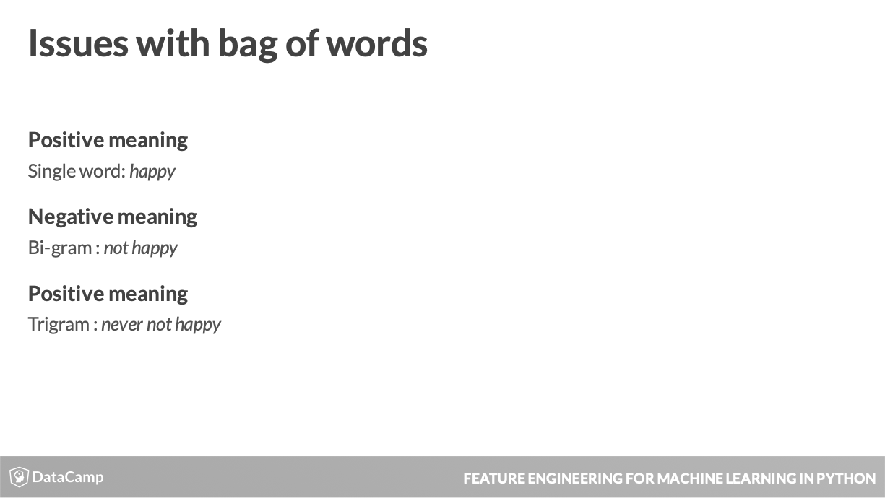

- One common method to retain at least some concept of word order in a text is to instead use multiple consecutive words like pairs (**bi-gram**) or three consecutive words (**tri-grams**).
  - This maintains at least some ordering information while at the same time allowing for the creation of a reasonable set of features.
  
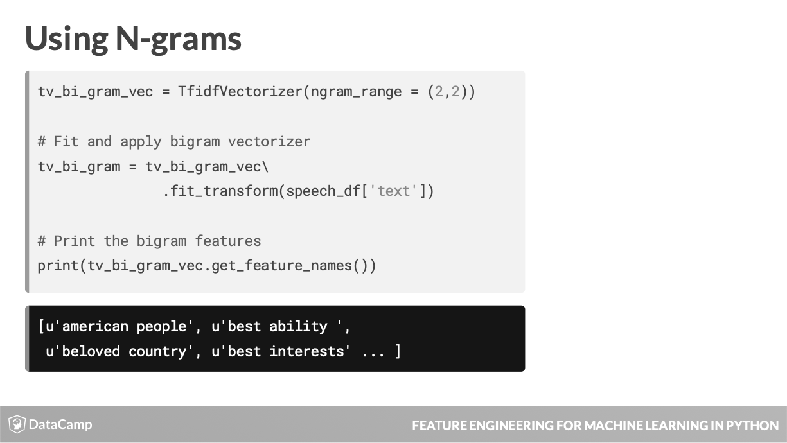

- To leverage **n-grams** in your own models, add an additional argument **ngram\_range** to your instantiation of TF-IDF vectorizer.
  - The values assigned to the argument are the minimum and maximum length of n-grams to be included.
  - In this example you'd only be looking at bi-grams (n-grams with two words).
    - Printing the bi-gram features created we can see the pairs of words instead of single words.

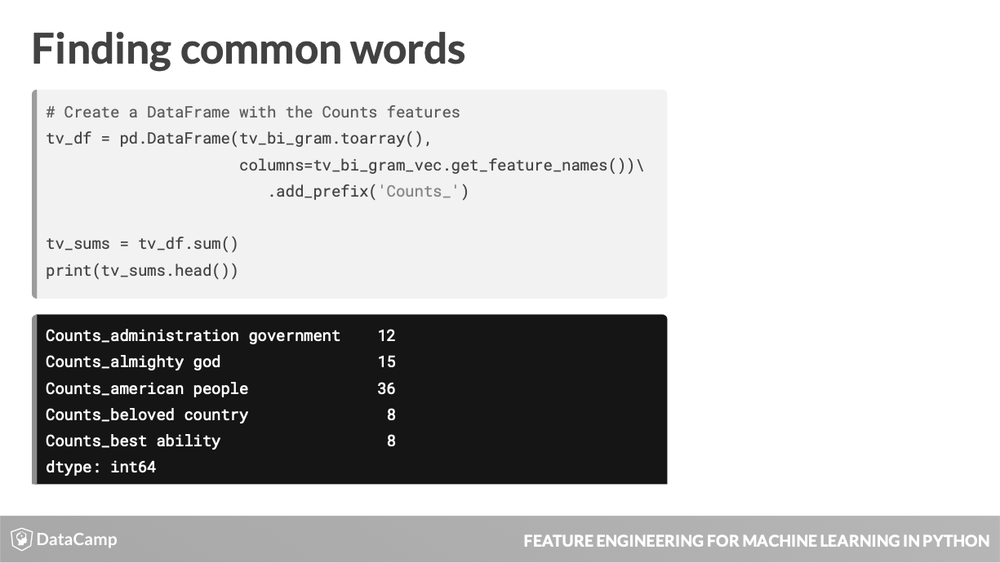

- When creating new features, you should always take time to check your work, and ensure that the features you are creating make sense.
  - A good way to check your n-grams is to see what are the most common values being recorded.
    - This can be done by summing the values of your DataFrame of count values that wer created suing the **sum()** method.
	
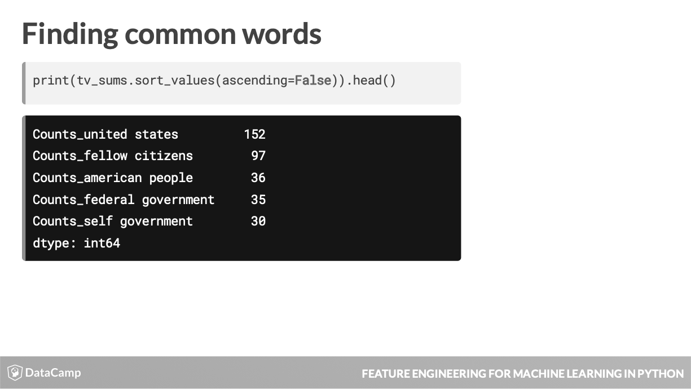

- After sorting the values in descending order you can see the most commonly occurring values.
  - It's not surprising that that most commonly occuring bi-gram in a dataset of US president's speeches is United States which indicates that the features being created make sense.
  

- So far you have created features based on individual words in each of the texts. This can be quite powerful when used in a machine learning model but you may be concerned that by looking at words individually a lot of the context is being ignored. To deal with this when creating models you can use n-grams which are sequence of n words grouped together. For example:
  - bigrams: Sequences of two consecutive words
  - trigrams: Sequences of two consecutive words
  
- These can be automatically created in your dataset by specifying the ngram_range argument as a tuple (n1, n2) where all n-grams in the n1 to n2 range are included.

		# Import CountVectorizer
		from sklearn.feature_extraction.text import CountVectorizer
		
		# Instantiate a trigram vectorizer
		cv_trigram_vec = CountVectorizer(max_features=100, 
		                                 stop_words='english', 
		                                 ngram_range = (3,3))
										 
		# Fit and apply trigram vectorizer
		cv_trigram = cv_trigram_vec.fit_transform(speech_df['text_clean'])
		
		# Print the trigram features
		print(cv_trigram_vec.get_feature_names())

  - Here you can see that by taking sequential word pairings, some context is preserved.

- Its always advisable once you have created your features to inspect them to ensure that they are as you would expect. This will allow you to catch errors early, and perhaps influence what further feature engineering you will need to do.   The vectorizer (cv) you fit in the last exercise and the sparse array consisting of word counts (cv_trigram) is available in your workspace.

		# Create a DataFrame of the features
		cv_tri_df = pd.DataFrame(cv_trigram.toarray(), 
		                 columns=cv_trigram_vec.get_feature_names()).add_prefix('Counts_')
						 
		# Print the top 5 words in the sorted output
		print(cv_tri_df.sum().sort_values(ascending=False).head())

  - That the most common trigram is _constitution united states_ makes a lot of sense for US presidents speeches.

| 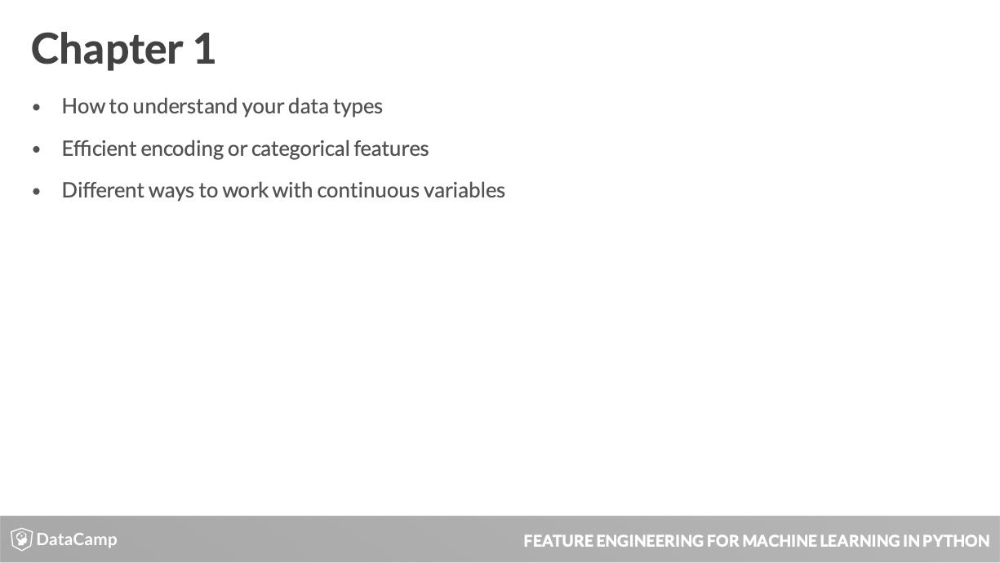 |
| :-: |
| Here, you learned how to better understand the underlying types of data contained in your dataset, how to create features out of categorical columns and how to bin continuous columns. |
| 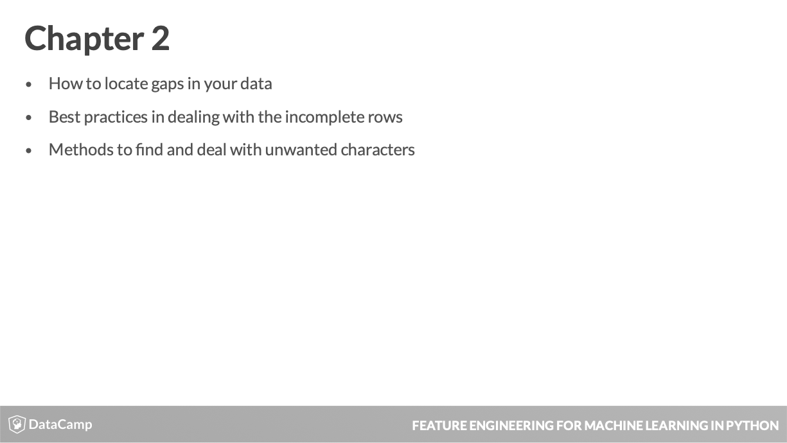 |
| Here, we explored how to deal with some of the challenges of real-world data, such as missing values and non-desirable characters in your data. |
| 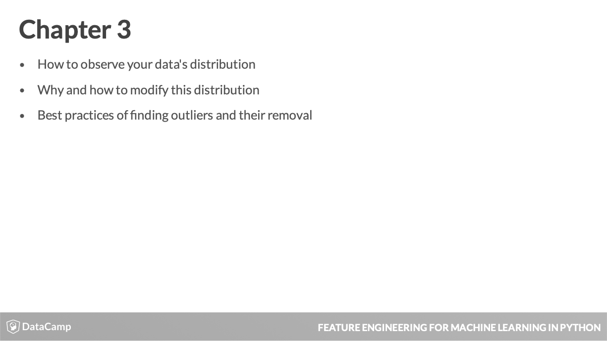 |
| Here, it was discussed how different distributions can affect your models and how to mitigate it, and different ways to deal with spurious outlier values in your dataset. |
| 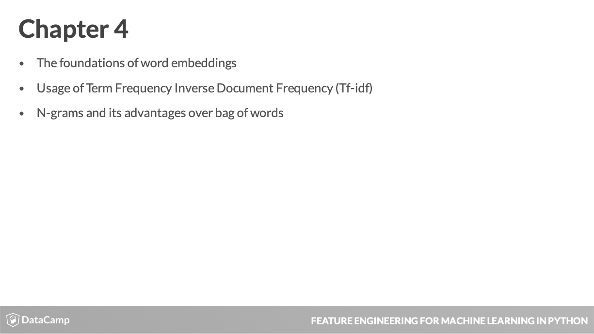 |
| Here, we explored how to deal with non tabular data such as free text and different ways to encode it for use with a machine learning model. |
