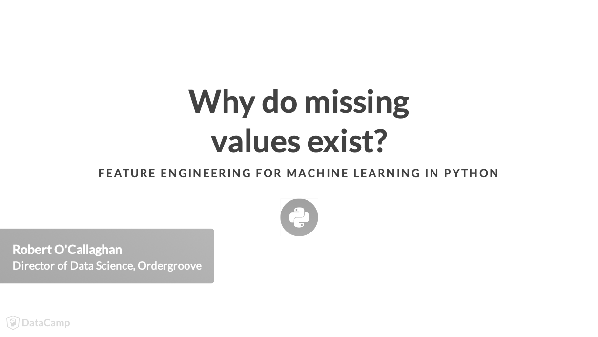

# Feature Engineering: Chapter 2 - Dealing with Messy Data #
Notes from the second chapter of the DataCamp Feature Engineering course accessible [here](https://learn.datacamp.com/courses/feature-engineering-for-machine-learning-in-python).

- This lesson will explore the concept of messy and missing values, how to find them, and once identified how to deal with them.

|  |
| :-: |
| Real-world data often has noise or omissions that can stem from many sources, like those above. |

- Data collection issue:
  - Paper surveys not being filled out fully
- Collection & Management Errors:
  - Making a mistake in transcribing the data.
- Omission issue:
  - Respondents skipping the age box in an online form.
- Transformation issue:
  - Average of a field with missing data.
  

- Many machine learning models can't work with missing values.
  - A linear regression models needs a value for every row and column used in the data set.
- Missing data can clue you in to a data pipeline issue.
  - If data is consistently missing in a certain column, you ought to investigate as to why this is the case.
- Missing data can also provide information in and of itself:
  - a missing value for children means no children.
  
|  |
| :-: |
| Use **info()** method for a preliminary look at data completeness. |

- Here you can see that StackOverflorJobsRecommend, Gender and RawSalary are highly underpopulated. Thi prompts investigating where these missing values occur.
- Thislist is useful but becomes limited with larger datasets that have values missing scattered all over their features.

- To find where these missing values exist, use the **isnull()** method.
  - All cells where missing values exist are shown as True.
  
|  |
| :-: |
| Count the number of missing values in a column by chaining **isnull()** with **sum()** methods. |
|  |
| Using **notnull()** will show you non-missing values (False). |

- Usage of **isnull()** & **notnull()** is allowed on the DataDrame as a whole and on each individual column.

- How sparse is my data?
  - Most data sets contain missing values, often represented as NaN (Not a Number). If you are working with Pandas you can easily check how many missing values exist in each column.    Let's find out how many of the developers taking the survey chose to enter their age (found in the Age column of so\_survey_df) and their gender (Gender column of so\_survey_df).
  
	    # Subset the DataFrame
	    sub_df = so_survey_df[['Age','Gender']]
        
	    # Print the number of non-missing values
	    print(sub_df.notnull().sum())

- Based on the results, the **Gender** column has 693 non-missing entries.

- Finding the missing values
  - While having a summary of how much of your data is missing can be useful, often you will need to find the exact locations of these missing values. Using the same subset of the StackOverflow data from the last exercise (sub_df), you will show how a value can be flagged as missing.
  
	    # Print the top 10 entries of the DataFrame
	    print(sub_df.head(10))
	
	    # Print the locations of the missing values
	    print(sub_df.head(10).isnull())
	
	    # Print the locations of the non-missing values
	    print(sub_df.head(10).notnull())

  - Finding where the missing values exist can often be important.
  

- Now that we can find the missing data, let's learn how to deal with them.

|  |
| :-: |
| Under **listwise deletion** the first and third rows will be dropped because of missing values in the _ConvertedSalary_ column. |

- If you're confident the missing values are occuring randomly (not intentionally being omitted) the most effective & statistically sound approach to dealing with them is called **complete case analysis** or **listwise deletion**.
  - In this method, a record is fully excluded from your model if any of its values are missing.
  

 - Using pandas to implement listwise deletion, set the _how_ argument to 'any', to delete all rows with at least one missing value.
 
|  |
| :-: |
| To drop rows with missing values in a specific column, use the _subset_ argument. |

- Pass a list of columns to the _subset_ argument to specify which columns to consider when deleting rows.

- While the prefereable approach to missing data is listwise deletion, there're drawbacks:
  - Any valid data points that share a row with th emissing values ger deleted.
  - If values don't occur at random, it can negatively affect the model.
  - Removing a feature instead of a row reduces the degrees of freedom of your model.
  

- The most common way to deal with missing values is to use the **fillna()** method.
  - You provide the value that you want to replace the missing values with.
  - With categorical columns, it's common to replace missing values with strings like 'Other', 'Not Given', etc.
  - To modify the values in-place, in the original DataFrame, set the _inplace_ argument to True.
  

- When you believe that the absence or presence of data is more important than the values themselves, you can create a column that records the absence of data and then drop the original column.
  - Call the **notnull()** method on a specific column, recording with True or False the presence of data.
  - To drop columns from a DataFrame, you can use the **drop()** method.
    - Specify a list of column names you want to drop via the _columns_ argument.

