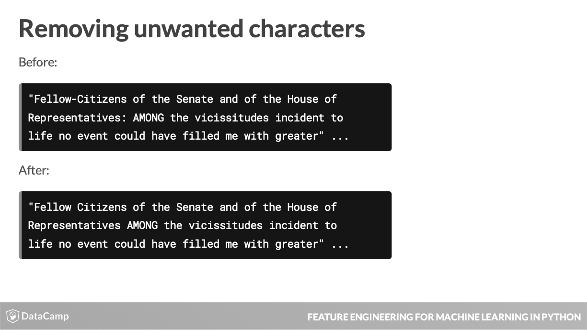

# Feature Engineering: Chapter 4 - Intro to Text Encoding #
Notes from the fourth chapter of the DataCamp Feature Engineering course accessible [here](https://learn.datacamp.com/courses/feature-engineering-for-machine-learning-in-python).

|  |
| :-: |
| This is an example of free text associated with a speech given by George Washington. |

- Data that is not in a predefined form is called unstructured data, and free text data is a good example of this.
- Before you can leverage text data ina  machine learning model you must first convert it into a series of columns of numbers or vectors.

|  |
| :-: |
| The 'text' column contains the body of the speech text. |

- Before any text analytics can be performed, the text data must be in a format that can be used.

|  |
| :-: |
| Here, using regular expressions will allow you to select non-letter characters. |

- Most bodies of text will have non letter characters such as punctuation, that will need ot be removed before analysis.
- Selecting all the letter characters and placing a caret infront negates this, making the selected characters non-letter and replace it with a white space.

|  |
| :-: |
| The text of the first speech before and after processing via .replace() & regular expressions.|
|  |
| Next standardize the remaining characters by making them all lowercase. |

- Standardizing the text, by making them all lowercase ensure that the same word with/out capitalization won't be counted as separate words.

|  |
| :-: |
| The len() method calculates the number of characters in each speech. |

- You can even create features based on the content of different texts, but often there is value in the fundamental characteristics of a passage, such as its length.

- You may want to learn how many words are contained in the text, by splitting the speech based on the white spaces and then count how many words after the split.
- First, use the split() method then chain the len() method to count the number of words in each speech.

|  |
| :-: |
| Simply dividing the character count by the number of words gives you the average word length. |

- You can also get the average word length.

- Unstructured text data cannot be directly used in most analyses. Multiple steps need to be taken to go from a long free form string to a set of numeric columns in the right format that can be ingested by a machine learning model. The first step of this process is to standardize the data and eliminate any characters that could cause problems later on in your analytic pipeline.    In this chapter you will be working with a new dataset containing the inaugural speeches of the presidents of the United States loaded as speech_df, with the speeches stored in the text column.

		# Print the first 5 rows of the text column
		print(speech_df.text.head())

